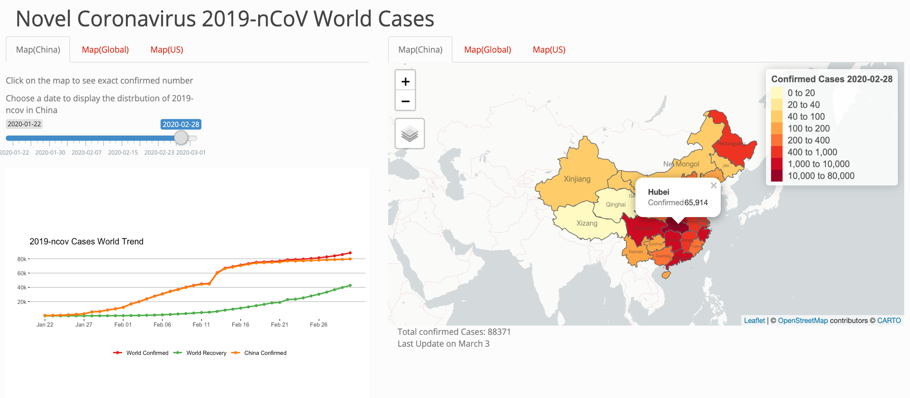
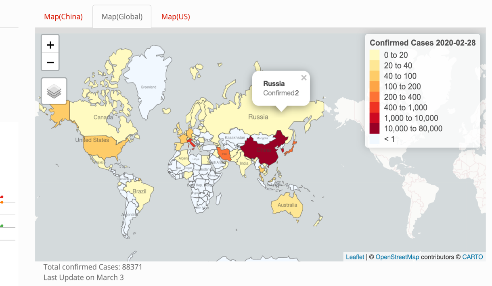
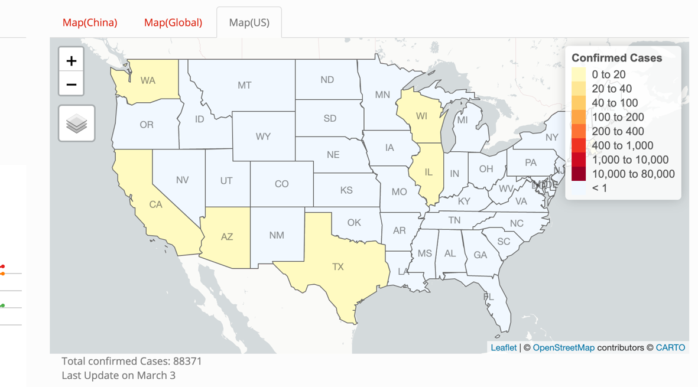
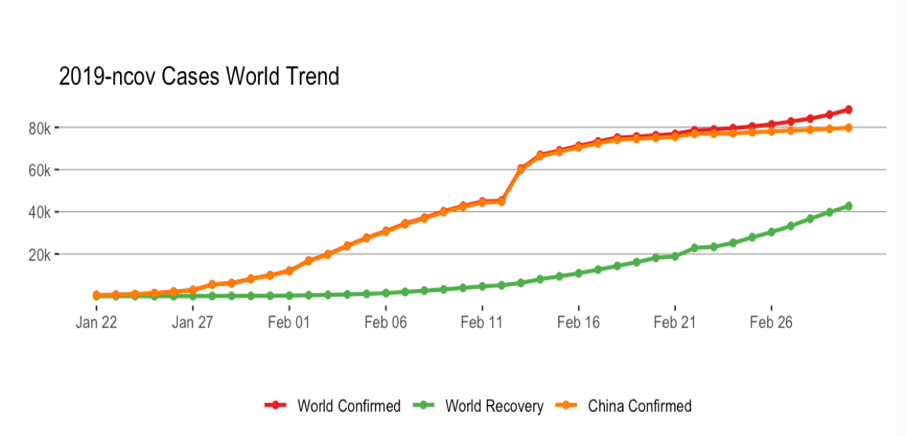

# 2019-nCov-Datadashboard-Rshiny
This project aims to display the spread of infectious disease (2019-nCoV - the novel coronavirus disease initially discovered in Chinese city of Wuhan) through time and space. The interactive graphics have the capability to recognize and track the changes in the complex system, therefore help to visualize and hypothesize important factors that may explain the spread pattern. 
### Method:
R Shiny is the main tool to build the interactive web app to visualize the 2019-nCoV spread globally from January 22 to March 3rd. In
addition to provide the worldwide disease distribution map, the interactive web-based dashboard also particularly track the outbreaks in China (which was most affected) and United States. Instead of using magnitude of bubbles to represent number of identified cases in a given geological area, this dashboard uses color to signal the presence of the virus. Three different ‘Shapefiles’, downloaded from Centers for Disease Control and Prevention (CDC), were implemented to build the maps. Other main R packages include:
* Map: Leaflet, sf, tmap
* Data Wrangling: Openintro, tidyverse,
anchors, reshape2, lubridate
* Style: RColorBrewer, shinythemes 
### Preview:

Total four maps/graphs are provided by the web app: Worldwide 2019- nCoV Confirmed and
Recovery Trend at the left bottom panel, China/US/Global Disease Distribution Maps at
the right tabset panel. The slider at the left side selects a specific date of the
distribution. The confirmed number will appear once the reader clicks on the geological area.

All maps use same color scale. The cut points
are determined by the distribution so that any
time and space variations would be highlighted.
Note that some countries do not have any 2019-
nCoV cases reported. 

### Discussion:
Current interactive dashboard utilizes 2019-
nCoV data from January 22 to March 3rd.
Future goal will focus on how to directly use
the real time data, and effectively incorporate
the number of recovery cases together on the
same/separate maps.

### Reference:
* 2019-nCoV Data Source: provided by Johns Hopkins University based on publicly available data from multiple sources: WHO, DXY.cn. Pneumonia, CDC, National Health Commission of the People’s Republic of China (NHC). https://github.com/CSSEGISandData/COVID-19
* Shapefiles: Centers for Disease Control and Prevention (CDC): https://www.cdc.gov/epiinfo/support/downloads/shapefiles.html
